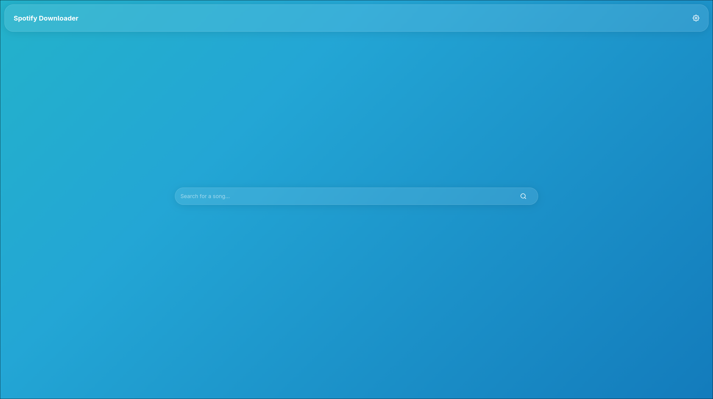
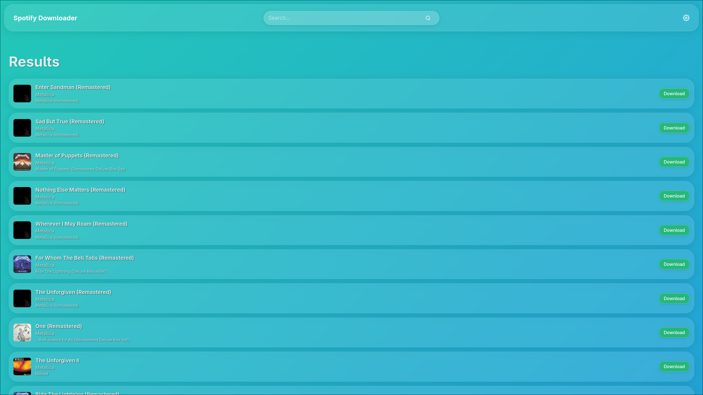

# Spotify Downloader Web Server
This is a simple version of [CLI-Spotify-Downloader's Web Server](https://github.com/w1l238/CLI-Spotify-Downloader) except written using [node.js](https://nodejs.org/en) and [vite](vite.dev) instead of python and static HTML/CSS.

## Features
This server features a simple web downloader for spotify songs. Using spotify API keys to search and Youtube (yt-dlp) to download the song and place in a structured folder path (`~/downloads/ARTIST_NAME/ALBUM_NAME/SONG_NAME.mp3`). The UI is mainly the same from the previous [spotify web server](https://github.com/w1l238/CLI-Spotify-Downloader)

## Screenshots

## Setup (Baremetal)
1. Visit [Spotify's Documentation](https://developer.spotify.com/documentation/web-api) on their web-api and walkthrough the app creation process to obtain you spotify api keys. These are free.
2. Use those api keys from spotify and paste them into `backend/.env`
3. You can then run `npm install` in both the `client` and `server` folders, then running `npm run dev` for frontend and `npm index.js` for backend. Once both are running you should be able to use.

## Docker
If you want to run it in a docker container edit `docker-compose.yml` to your configuration and run `docker-compose up --build -d` to get it running.